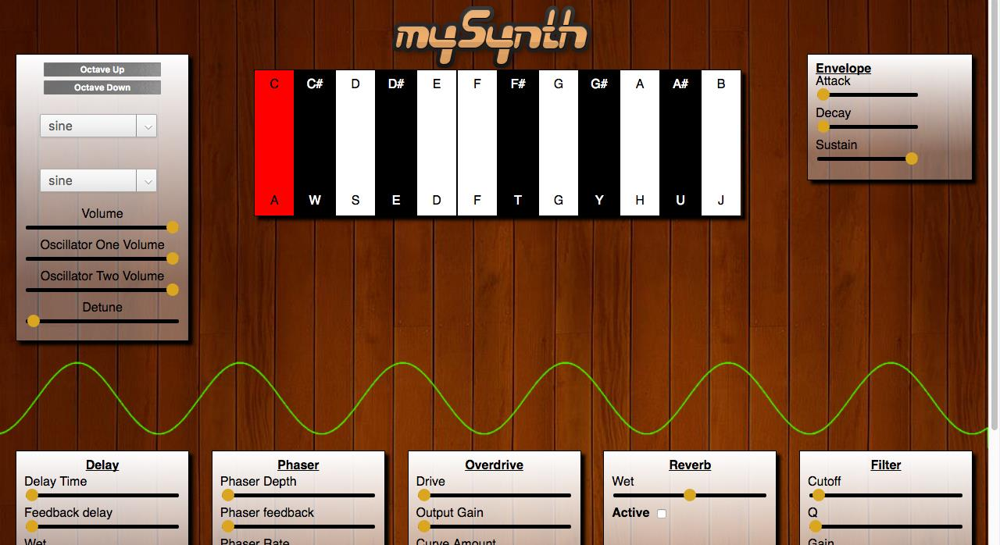

# mySynth

## Overview

<!-- [mysynth Live](http://johnvanschultz.site/mySynth) -->
<a href="http://johnvanschultz.site/mySynth">mySynth</a>

mySynth is a polyphonic digital synthesizer created using JavaScript. Additional libraries include jQuery, Web Audio API, and Tuna.js.



## Technolgies

* JavaScript
* jQuery
* Web Audio Api
* Tuna.js
* Webpack
* Babel

## Web Audio API

The main functionality of mySynth comes from JavaScript's Web Audio API. Web Audio API uses an audio context which outputs to a designated output source(in this case, the computer speakers). Oscillator Nodes or Audio Buffer Nodes can be connected to the Audio Context to output sound.

```javascript

const audioCtx = new (window.AudioContext)();
export default audioCtx;

```

A jQuery event listener is used to detect keypresses. Each key stores the frequency which should be played upon the activation of the corresponding note. Upon a keypress, two Web Audio API oscillator objects will be created with the appropriate frequency and the note will begin to play. On keyup, these oscillator objects will be destroyed and note will stop.

```javascript

$(document).on("keydown", e => {
  let key = $("div[data-key-id = " + e.keyCode + "]")
  if (key.length === 0) {
    return null;
  }
  key.addClass('red')
  if (activeNotes[e.keyCode]) return null;
    oscs = playTone($(key[0]).attr("data-frequency"))
    activeNotes[e.keyCode] = oscs;
    if (!oscs) return null;
})
$(document).on('keyup', e => {
  if (!oscs) return null;
    let toStop = activeNotes[e.keyCode]
    $("div[data-key-id = " + e.keyCode + "]").removeClass('red')
    if (!toStop) return null;
    toStop.forEach((osc,idx) => {
        osc.stop();
    });
    activeNotes[e.keyCode] = null;
})

```

## Effects

The effects chain(delay, phaser, overdrive, reverb, filter) is implemented using the Tuna.js library. An instance of the Tuna class is connected to Web Audio API's Audio context, which allows all Tuna.js effects to be added as nodes between the oscillator node and our Audio Context output.

```javascript

const tuna = new Tuna(audioCtx);
export const delay = new tuna.Delay({
      feedback: 0.2,
      delayTime: 200, //this will create a short "slap back" delay
      wetLevel: 0.7,
      dryLevel: 1,
      cutoff: 5000,
      bypass: true
});

export const phaser = new tuna.Phaser({
    rate: 1.2,                     //0.01 to 8 is a decent range, but higher values are possible
    depth: 0,                    //0 to 1
    feedback: 0.0,                 //0 to 1+
    stereoPhase: 30,               //0 to 180
    baseModulationFrequency: 700,  //500 to 1500
    bypass: 1
});

export const overdrive = new tuna.Overdrive({
    outputGain: 0.01,         //0 to 1+
    drive: 0.01,              //0 to 1
    curveAmount: 0,          //0 to 1
    algorithmIndex: 0,       //0 to 5, selects one of our drive algorithms
    bypass: 1
});

export const convolver = new tuna.Convolver({
    highCut: 22050,                         //20 to 22050
    lowCut: 20,                             //20 to 22050
    dryLevel: 1,                            //0 to 1+
    wetLevel: 1,                            //0 to 1+
    level: 1,                               //0 to 1+, adjusts total output of both wet and dry
    impulse: "impulses/BatteryBenson.wav",    //the path to your impulse response
    bypass: 1
});

export const filter = new tuna.Filter({
    frequency: 440, //20 to 22050
    Q: 1, //0.001 to 100
    gain: 3.4028234663852886, //-40 to 40 (in decibels)
    filterType: "lowpass", //lowpass, highpass, bandpass, lowshelf, highshelf, peaking, notch, allpass
    bypass: 0
});

```

Since a new oscillator object is created on each keypress, all nodes to be re-connected to the new oscillator. This is done using the connectNodes helper method.

```javascript

function connectNodes(osc, osc2) {
  oscVolume.gain.value = oscGain;
  osc2Volume.gain.value = osc2Gain;
  let initialValue = envelope.gain.setValueAtTime(0, audioCtx.currentTime);
  envelope.gain.linearRampToValueAtTime(1, audioCtx.currentTime + attack / 1000);
  envelope.gain.linearRampToValueAtTime(sustain, audioCtx.currentTime + decay / 1000)
  osc.connect(oscVolume);
  oscVolume.connect(envelope);
  osc2.connect(osc2Volume);
  osc2Volume.connect(envelope);
  envelope.connect(filter);
  filter.connect(masterGainNode);
  masterGainNode.connect(delay);
  delay.connect(phaser);
  phaser.connect(overdrive);
  overdrive.connect(convolver);
  convolver.connect(analyser)
  analyser.connect(audioCtx.destination)
  return null;
}

```

## Analyzer

Web Audio API and HTML5 Canvas are utilized in order to display a real-time waveform representing mySynth's current settings. A new ```Web Audio API analyser node``` is created and a ```Fast Fourier Transform(fft)``` value is set to determine the frequency domain which will be analyzed(default is 2048). This fft value is then passed in to create an ```Uint8Array(An array of 8 bit unsigned integers)``` in which all elements will be initialized to 0. The getByteTimeDomainData function will copy the current waveform into our array. This will be the basis of the waveform.

```javascript

let analyser = audioCtx.createAnalyser();
let bufferLength = analyser.fftSize = 2048;
let dataArray = new Uint8Array(bufferLength);
analyser.getByteTimeDomainData(dataArray);

```

A Canvas draw method is then used to iterate through the dataArray and represent it on the display.

```javascript

let canvas;
let canvasCtx;
document.addEventListener("DOMContentLoaded", () => {
  canvas = document.getElementById("oscilloscope");
  canvasCtx = canvas.getContext("2d");
})

function draw() {
  canvasCtx.clearRect(0, 0, canvas.width, canvas.height);
  let drawVisual = requestAnimationFrame(draw);
  analyser.getByteTimeDomainData(dataArray);
  canvasCtx.fillStyle = 'rgba(255, 255, 255, 0.0)';
  canvasCtx.fillRect(0, 0, canvas.width, canvas.height);
  canvasCtx.lineWidth = 1;
  canvasCtx.strokeStyle = 'rgb(68, 255, 0)';
  canvasCtx.beginPath();

  var sliceWidth = canvas.width * 1.0 / bufferLength;
  var x = 0;

  for (var i = 0; i < bufferLength; i++) {

    var v = dataArray[i] / 128.0;
    var y = v * canvas.height / 2;
    if (i === 0) {
      canvasCtx.moveTo(x, y);
    } else {
      canvasCtx.lineTo(x, y);
    }

    x += sliceWidth;
  }
  canvasCtx.lineTo(canvas.width, canvas.height);
  canvasCtx.stroke();

};

```
